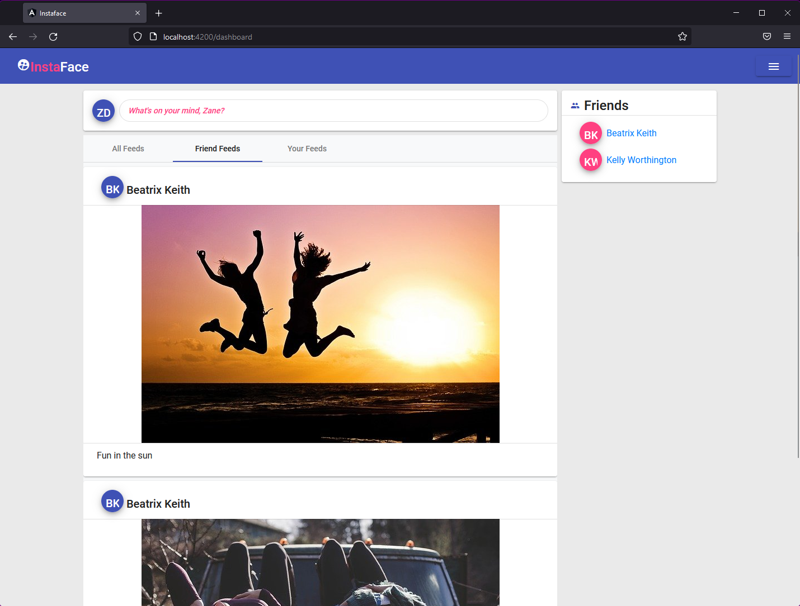

# Project 2 – Social Media Website - InstaFace
[Backend](https://github.com/Servation/instaface-app)

In this document, all requirements and required technologies pertaining the second full stack project of the training will be presented. All users on the website can login and submit requests to post their images, view images, and share their lives with their friends on the platform. Each user, has their own dashboard with which they can navigate through the platform and start their adventure on InstaFace.

## User can: 

- Register
- Log in and log out
- Create a profile and edit it anytime
- Create new post
- Use the dashboard
- Utilize the navigation bar
- Send friends requests
- Accept pending friend requests
- View the global feeds, friend feeds, own feeds

## Technologies used

### Frontend
- TypeScript
- Angular
- Angular Material
- BootStrap
- HTML/CSS 

### Backend
- Java 17 
- Spring Boot 
- Spring MVC 
- JUnit 
- MySQL
- Maven 
- Hibernate/JDBC

## Project Showcase

[More...](https://github.com/nicktor19/social-media-app/tree/master/src/assets/images)

## Contributors

- Alejandro Zubillaga
- Jeffrey Saelee
- Nicholas Torres
